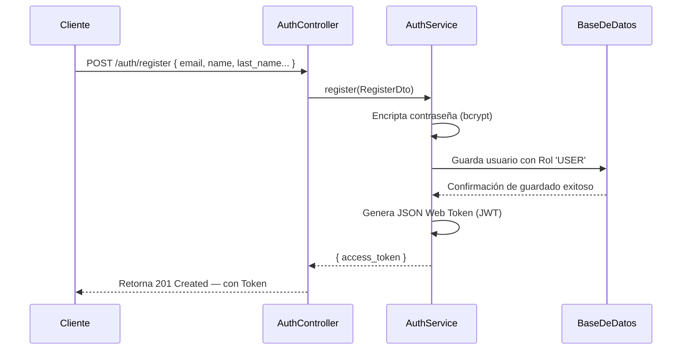

# Arquitectura del Módulo de Autenticación y Usuarios

## Descripción General

En **UniOpenCourse**, la gestión de usuarios y la autenticación están integrados en un único módulo para centralizar la seguridad: el **Módulo de Auth**. No existe un módulo independiente solo para usuarios, ya que las operaciones de creación y validación recaen directamente sobre los servicios de autenticación y la base de datos a través de **Prisma ORM**.

La lógica del sistema se distribuye de la siguiente manera:

| Responsabilidad              | Componente Encargado               |
|-----------------------------|------------------------------------|
| Creación de usuario          | `AuthService.register()`           |
| Autenticación de usuario     | `AuthService.login()`              |
| Autenticación de admin       | `AuthService.adminLogin()`         |
| Modelo de datos              | Esquema de Base de Datos (`Prisma`) |
| Autorización por roles       | `RolesGuard` + Decorador `@Roles()`|
| Verificación de identidad    | `JwtStrategy` + `JwtAuthGuard`     |

---

## Estructura Interna del Módulo

El flujo de trabajo se organiza en controladores, servicios, DTOs y Guards, siguiendo las buenas prácticas de NestJS:

```text
auth/
├── auth.module.ts              # Configuración principal y dependencias JWT
├── auth.controller.ts          # Exposición de Endpoints de acceso/registro
├── auth.service.ts             # Lógica de negocio (registro, login, logout)
├── dto/
│   ├── register.dto.ts         # Validaciones para crear un usuario
│   └── login.dto.ts            # Validaciones para inicio de sesión
├── strategies/
│   └── jwt.strategy.ts         # Estrategia de Passport para decodificar JWT
├── guards/
│   ├── jwt-auth.guard.ts       # Guard para requerir un token JWT válido
│   └── roles.guard.ts          # Guard para requerir un rol específico
└── decorators/
    └── roles.decorator.ts      # Decorador personalizado `@Roles()`
```

---

## Diagrama de Componentes

```mermaid
graph TD
    subgraph Módulo Auth
        AC[AuthController]
        AS[AuthService]
        JS[JwtStrategy]
        JG[JwtAuthGuard]
        RG[RolesGuard]
        RD["@Roles() Decorator"]
    end

    subgraph Validaciones (DTOs)
        RDTO[RegisterDto]
        LDTO[LoginDto]
    end

    subgraph Infraestructura
        PS[PrismaService]
        JWT[JwtService]
        CFG[ConfigService]
    end

    subgraph Base de Datos (PostgreSQL)
        UM[(Tabla User)]
        RM[(Tabla Role)]
        LCV[(Tabla LastCourseVisit)]
    end

    AC -->|Usa| AS
    AS -->|Inyecta| PS
    AS -->|Genera Token| JWT
    JS -->|Lee Secret| CFG
    JS -->|Valida| JWT
    JG -->|Hereda de| PassportStrategy
    RG -->|Verifica metadata| RD
    AC -->|Valida request con| RDTO
    AC -->|Valida request con| LDTO
    PS --> UM
    PS --> RM
    UM -->|Foreign Key| RM
    UM -->|Relación 1:N| LCV
```

---

## Flujo de Creación de Usuario (Registro)

El siguiente modelo ilustra el proceso interno al registrar un usuario en el sistema:



---

## Sistema de Roles y Autorización

Para manejar los niveles de acceso, el sistema utiliza dos roles globales (precargados inicialmente en la base de datos):

| Rol     | Nivel de Acceso                                  |
|---------|--------------------------------------------------|
| `USER`  | Nivel estándar. Asignado por defecto al registrarse. |
| `ADMIN` | Nivel administrativo. Asignado manualmente por seguridad. |

**Uso práctico en código:**
Para proteger una ruta y restringirla solo a administradores, se combinan Guards y Decoradores:

```typescript
@UseGuards(JwtAuthGuard, RolesGuard)
@Roles('ADMIN')
@Get('ruta-administrativa')
metodoRestringido() { ... }
```

---

## Tecnologías y Dependencias Principales

El módulo utiliza librerías estándares de seguridad y encriptación:

| Herramienta / Paquete   | Propósito Integrado                             |
|-------------------------|-------------------------------------------------|
| `@nestjs/jwt`           | Creación segura y lectura de tokens JWT.        |
| `@nestjs/passport`      | Motor subyacente para estrategias de seguridad. |
| `passport-jwt`          | Verificación del contenido del JWT.             |
| `bcrypt`                | Hashing unidireccional de contraseñas.          |
| `@nestjs/config`        | Lectura segura de secretos desde variables de entorno. |
