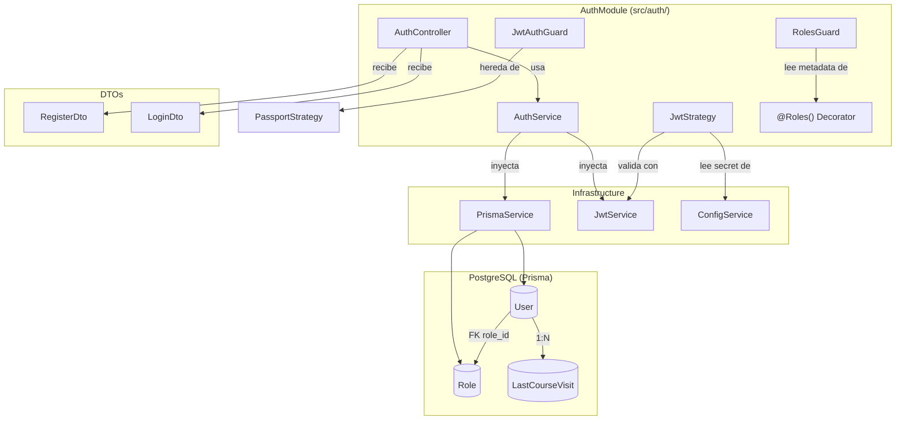
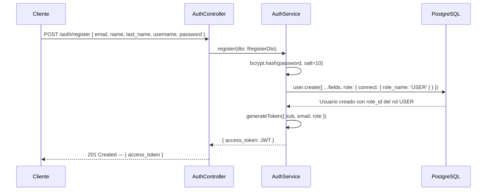

# Arquitectura — Módulo Users

## Descripción General

El módulo de **Users** en UniOpenCourse no existe como un módulo NestJS independiente. La creación y autenticación de usuarios está integrada dentro del **módulo Auth** (`src/auth/`). La definición de la entidad `User` y sus relaciones se gestiona a través del esquema de **Prisma ORM**.

La lógica relacionada con usuarios se distribuye de la siguiente manera:

| Responsabilidad              | Ubicación                          |
|-----------------------------|------------------------------------|
| Creación de usuario          | `AuthService.register()`            |
| Autenticación de usuario     | `AuthService.login()`               |
| Autenticación de admin       | `AuthService.adminLogin()`          |
| Modelo de datos `User`       | `prisma/schema.prisma`              |
| Autorización por roles       | `RolesGuard` + decorador `@Roles()` |
| Verificación de identidad    | `JwtStrategy` + `JwtAuthGuard`      |

---

## Estructura de Archivos

```
apps/backend/src/auth/
├── auth.module.ts              # Configuración del módulo y dependencias JWT
├── auth.controller.ts          # Endpoints de autenticación / registro
├── auth.service.ts             # Lógica de negocio (register, login, logout)
├── dto/
│   ├── register.dto.ts         # Datos requeridos para crear un usuario
│   └── login.dto.ts            # Datos requeridos para iniciar sesión
├── strategies/
│   └── jwt.strategy.ts         # Estrategia Passport para validar JWT
├── guards/
│   ├── jwt-auth.guard.ts       # Guard que protege rutas con JWT
│   └── roles.guard.ts          # Guard que valida el rol del usuario
└── decorators/
    └── roles.decorator.ts      # Decorador @Roles() para marcar roles requeridos
```

---

## Diagrama de Componentes



---

## Flujo de Creación de Usuario (Registro)



---

## Sistema de Roles

El sistema maneja dos roles predefinidos, inicializados mediante el seed de base de datos:

| Rol     | Descripción                                     |
|---------|-------------------------------------------------|
| `USER`  | Rol por defecto asignado al registrarse          |
| `ADMIN` | Rol administrativo, asignado manualmente via seed |

Los roles se aplican en las rutas usando la combinación de guards y decoradores:

```typescript
@UseGuards(JwtAuthGuard, RolesGuard)
@Roles('ADMIN')
@Get('ruta-protegida')
metodoProtegido() { ... }
```

---

## Dependencias del Módulo

| Paquete               | Versión  | Uso                                    |
|-----------------------|----------|----------------------------------------|
| `@nestjs/jwt`         | —        | Firma y verificación de tokens JWT     |
| `@nestjs/passport`    | —        | Integración de estrategias Passport    |
| `passport-jwt`        | —        | Estrategia JWT para Passport           |
| `bcrypt`              | —        | Hashing seguro de contraseñas          |
| `@nestjs/config`      | —        | Lectura de `JWT_SECRET` desde `.env`   |
| `@prisma/client`      | —        | Acceso a la base de datos              |
