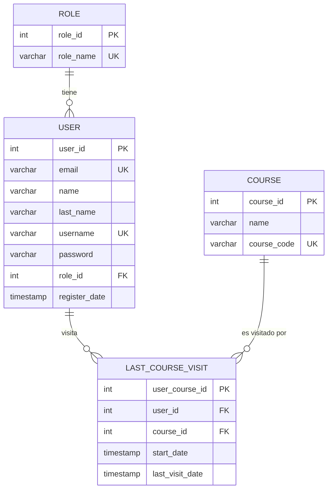

# Base de Datos — Módulo Users

## Motor de Base de Datos

- **Motor:** PostgreSQL
- **ORM:** Prisma
- **Archivo de esquema:** `apps/backend/prisma/schema.prisma`
- **Cliente generado en:** `apps/backend/src/generated/prisma`

---

## Modelos Relacionados con Users

### Modelo `Role`

Almacena los tipos de roles disponibles en el sistema.

```prisma
model Role {
  role_id   Int    @id @default(autoincrement())
  role_name String @unique @db.VarChar(50)
  users     User[]
}
```

**Tabla en BD:** `Role`

| Columna     | Tipo           | Restricciones         | Descripción                       |
|-------------|----------------|-----------------------|-----------------------------------|
| `role_id`   | `INT`          | PK, AUTO INCREMENT    | Identificador único del rol       |
| `role_name` | `VARCHAR(50)`  | UNIQUE, NOT NULL      | Nombre del rol (`ADMIN` / `USER`) |

**Datos iniciales (seed):**

| `role_id` | `role_name` |
|-----------|-------------|
| 1         | `ADMIN`     |
| 2         | `USER`      |

---

### Modelo `User`

Almacena los datos de todos los usuarios registrados en el sistema.

```prisma
model User {
  user_id         Int               @id @default(autoincrement())
  email           String            @unique @db.VarChar(75)
  name            String            @db.VarChar(50)
  last_name       String            @db.VarChar(50)
  username        String            @unique @db.VarChar(70)
  password        String            @db.VarChar(255)
  role_id         Int
  register_date   DateTime          @default(now())
  role            Role              @relation(fields: [role_id], references: [role_id])
  visited_courses LastCourseVisit[]
}
```

**Tabla en BD:** `User`

| Columna         | Tipo           | Restricciones               | Descripción                                      |
|-----------------|----------------|-----------------------------|--------------------------------------------------|
| `user_id`       | `INT`          | PK, AUTO INCREMENT          | Identificador único del usuario                  |
| `email`         | `VARCHAR(75)`  | UNIQUE, NOT NULL            | Correo electrónico del usuario                   |
| `name`          | `VARCHAR(50)`  | NOT NULL                    | Nombres del usuario                              |
| `last_name`     | `VARCHAR(50)`  | NOT NULL                    | Apellidos del usuario                            |
| `username`      | `VARCHAR(70)`  | UNIQUE, NOT NULL            | Nombre de usuario para identificación            |
| `password`      | `VARCHAR(255)` | NOT NULL                    | Contraseña hasheada con bcrypt (salt rounds: 10) |
| `role_id`       | `INT`          | FK → `Role.role_id`         | Rol asignado al usuario                          |
| `register_date` | `TIMESTAMP`    | DEFAULT `now()`             | Fecha y hora de registro automática              |

---

### Modelo `LastCourseVisit`

Tabla de relación que registra qué cursos ha visitado cada usuario y cuándo fue su última visita.

```prisma
model LastCourseVisit {
  user_course_id    Int      @id @default(autoincrement())
  user_id           Int
  course_id         Int
  start_date        DateTime @default(now())
  last_visit_date   DateTime @updatedAt
  user              User     @relation(fields: [user_id], references: [user_id], onDelete: Cascade)
  course            Course   @relation(fields: [course_id], references: [course_id], onDelete: Cascade)

  @@unique([user_id, course_id])
}
```

**Tabla en BD:** `LastCourseVisit`

| Columna           | Tipo        | Restricciones                        | Descripción                              |
|-------------------|-------------|--------------------------------------|------------------------------------------|
| `user_course_id`  | `INT`       | PK, AUTO INCREMENT                   | Identificador único del registro         |
| `user_id`         | `INT`       | FK → `User.user_id`, CASCADE DELETE  | Usuario que visitó el curso              |
| `course_id`       | `INT`       | FK → `Course.course_id`, CASCADE DELETE | Curso visitado                        |
| `start_date`      | `TIMESTAMP` | DEFAULT `now()`                      | Fecha en que el usuario inició el curso  |
| `last_visit_date` | `TIMESTAMP` | `@updatedAt` (auto-actualiza)        | Fecha de la última visita al curso       |

**Restricción única:** La combinación `(user_id, course_id)` es única — un usuario no puede tener registros duplicados para el mismo curso.

**Eliminación en cascada:** Si se elimina un `User` o un `Course`, sus registros de visita se eliminan automáticamente.

---

## Diagrama Entidad-Relación (Users)



---

## Migraciones Aplicadas

Las siguientes migraciones de Prisma afectaron la estructura de las tablas de usuarios y roles:

| Migración                                          | Cambio aplicado                                     |
|----------------------------------------------------|-----------------------------------------------------|
| `20260306030807_init`                              | Creación inicial de todas las tablas                |
| `20260311220700_fix_deleting_cascade`              | Configuración de eliminación en cascada             |
| `20260311222134_enlarging_nombres_database`        | Ampliación de longitud en columnas de nombres       |
| `20260315031824_chanching_english_database`        | Renombrado de columnas al inglés                    |
| `20260319003032_adding_unique_role_name`           | Restricción `UNIQUE` añadida a `role_name`          |

---

## Seed Inicial

El archivo `apps/backend/prisma/seed.ts` inicializa los datos mínimos necesarios:

**Roles creados:**
- `ADMIN`
- `USER`

**Usuario administrador de prueba:**

| Campo       | Valor            |
|-------------|------------------|
| `email`     | `admin@test.com` |
| `username`  | `admin123`       |
| `name`      | `Franz`          |
| `last_name` | `Nuñez`          |
| `password`  | `123456` (hasheado con bcrypt) |
| `role_id`   | ID del rol `ADMIN` |

**Ejecutar seed:**
```bash
cd apps/backend
npx prisma db seed
```

---

## Comandos Útiles de Prisma

```bash
# Generar cliente Prisma después de cambios en el schema
npx prisma generate

# Aplicar migraciones en desarrollo
npx prisma migrate dev

# Aplicar migraciones en producción
npx prisma migrate deploy

# Ver datos en la base de datos (Prisma Studio)
npx prisma studio
```
