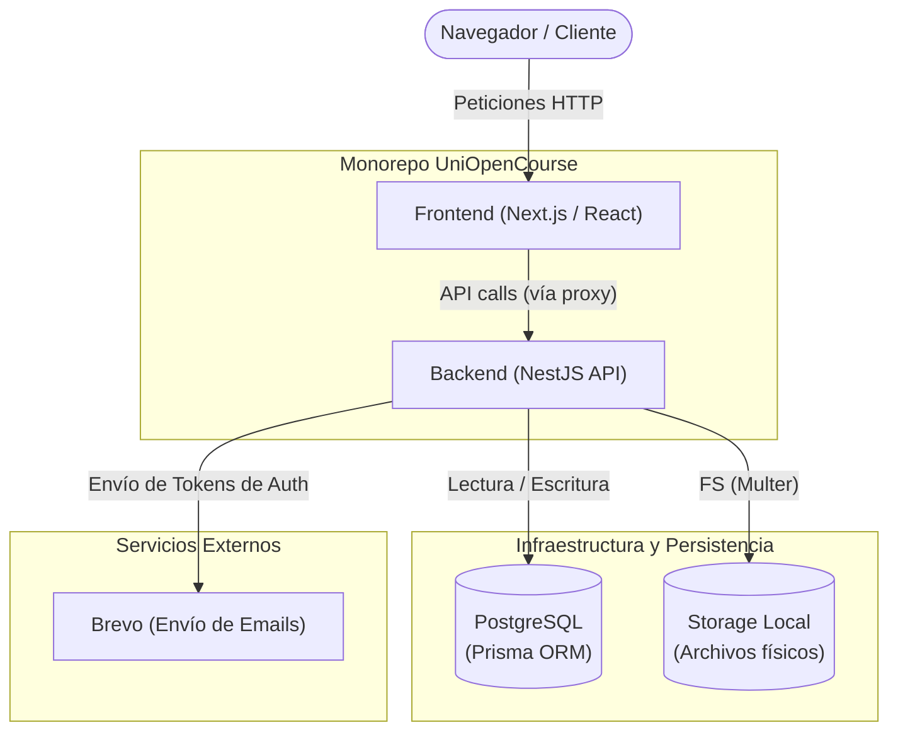

# Arquitectura - UniOpenCourse

## Propósito

Explicar la organización general del sistema, sus principales componentes y cómo interactúan entre sí para ofrecer la plataforma educativa.

## Vista general

El sistema está dividido en dos aplicaciones principales dentro de un monorepo.

## Componentes principales

- **Frontend**: Aplicación web desarrollada con **Next.js** (App Router) y React. Actúa como cliente consumiendo la API, manejando el enrutamiento y la renderización (SSR/CSR).
- **Backend**: API RESTful robusta y modular creada con **NestJS**. Maneja la lógica de negocio, validaciones y acceso a datos.
- **Base de datos**: Motor relacional **PostgreSQL**, utilizando **Prisma ORM** para el tipado seguro (Type Safety) y las migraciones.
- **Autenticación**: Sistema basado en JSON Web Tokens (**JWT**). Los tokens se manejan de manera segura mediante cookies `HttpOnly` a través de un proxy en Next.js, protegiendo contra ataques XSS.
- **Almacenamiento de archivos**: Manejado internamente de forma local (usando _Multer_), alojando las imágenes de los cursos y materiales subidos, y exponiéndolos a través del backend.

## Flujos principales

- **Registro e inicio de sesión**: Creación de la cuenta de usuario en PostgreSQL, envío de un correo con un token seguro para verificar el email (usando Brevo), y login que devuelve las cookies con los tokens de sesión.
- **Consulta de cursos**: Los usuarios pueden listar y buscar cursos (paginados), acceder a la información de las clases correspondientes y ver los diferentes tipos de materiales (enlaces, archivos, referencias).
- **Seguimiento de rutas**: El sistema rastrea automáticamente la interacción del usuario (`LastCourseVisit`), permitiendo retomar los cursos visitados recientemente.
- **Administración de cursos y clases**: Endpoints protegidos (con roles, ej. `ADMIN`) para realizar operaciones CRUD (crear, leer, actualizar, borrar) de cursos, clases y materiales, validando tamaños y tipos de archivos subidos.

## Decisiones técnicas

- **Monorepo**: Facilita tener los proyectos interrelacionados (frontend/backend) en un solo repositorio, unificando controles de versiones.
- **Prisma ORM**: Se escogió por su potente autocompletado y sincronización declarativa (`schema.prisma`), haciendo las consultas a DB seguras contra errores de tipo.
- **Cookies `HttpOnly`**: Se delegó la seguridad del JWT a cookies configuradas desde un proxy (en `lib/api-client.ts`), en lugar de dejar el token en el _LocalStorage_ del navegador.
- **Almacenamiento local**: Inicialmente se optó por guardar archivos en el sistema de archivos del servidor backend mediante _Multer_ por simplicidad y reducción de costos iniciales, con URLs que hacen proxy hacia ellos (`/storage/**`).

## Riesgos técnicos

- **Cuello de botella en Almacenamiento (Storage)**: Como los archivos se guardan físicamente en el servidor backend, dificultará en un futuro el escalamiento horizontal (añadir más servidores). Si el servidor falla, se pierde el acceso a las imágenes y materiales. (Se recomienda migrar a un S3-compatible en el futuro).
- **Dependencia de servicios externos para Correos**: El registro de usuarios depende enteramente de que Brevo funcione. Si su API se cae, se bloqueará la entrada de nuevos usuarios.
- **Sincronización de Tipos Frontend-Backend**: Al no usar herramientas estrictas como tRPC o OpenAPI generators automático, existe el riesgo de desincronización manual entre los DTOs del backend y las interfaces del frontend.
