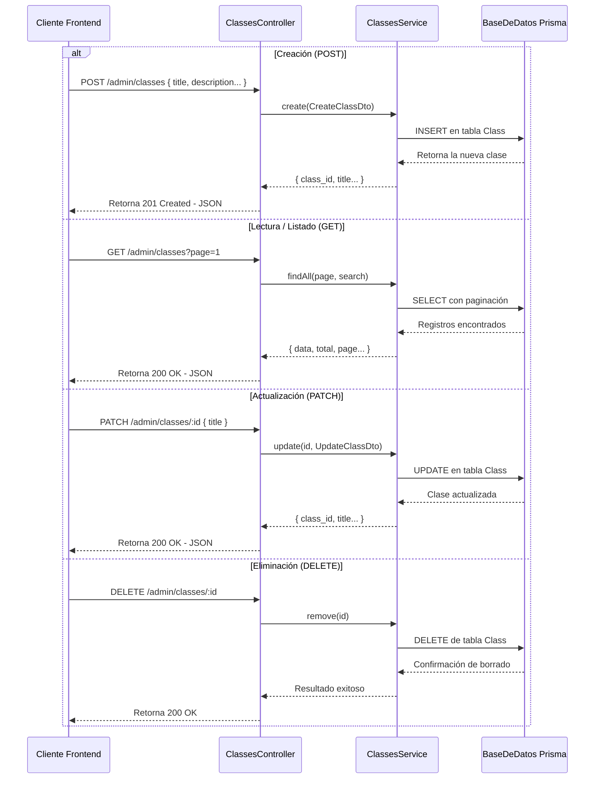
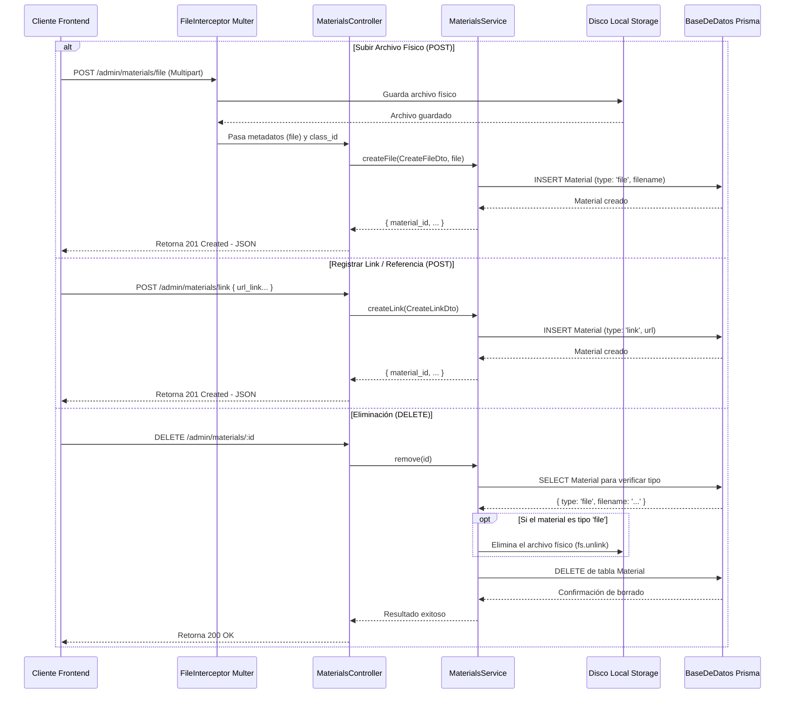

## Módulo: Classes

### Ubicación en el repositorio

| Qué             | Ruta                                |
| --------------- | ----------------------------------- |
| API pública     | `apps/backend/src/classes/`         |
| API admin       | `apps/backend/src/admin/classes/`   |
| Modelo de datos | `apps/backend/prisma/schema.prisma` |

### Responsabilidades

#### Pública — `/classes` (y jerarquía)

| Área       | Qué cubre                                                               |
| ---------- | ----------------------------------------------------------------------- |
| Listado    | Lecciones pertenecientes a un curso específico (`/courses/:id/classes`) |
| Detalle    | Información de una lección (título, descripción, video)                 |
| Materiales | Listado de recursos asociados a la clase (`/classes/:id/materials`)     |

#### Admin — `/admin/classes`

| Área       | Qué cubre                                              |
| ---------- | ------------------------------------------------------ |
| CRUD       | Alta, listado, detalle, actualización y baja de clases |
| Paginación | Soporte para `page` y `search` en el listado general   |

**Operaciones CRUD:**

| Acción      | Método   | Ruta                 | Qué se envía (Body) |
| ----------- | -------- | -------------------- | ------------------- |
| Crear       | `POST`   | `/admin/classes`     | `CreateClassDto`    |
| Listar Todo | `GET`    | `/admin/classes`     | *(vacío)*           |
| Ver Detalle | `GET`    | `/admin/classes/:id` | *(vacío)*           |
| Actualizar  | `PATCH`  | `/admin/classes/:id` | `UpdateClassDto`    |
| Eliminar    | `DELETE` | `/admin/classes/:id` | *(vacío)*           |

**Flujo del Sistema (Diagrama de Secuencia):**
El siguiente modelo ilustra el proceso interno para las distintas operaciones CRUD en el módulo de Clases.

Detalle del DTO y reglas: [endpoints.md — Classes](./endpoints.md#classes).

### Modelo de datos (resumen)

#### Entidad `Class`

| Campo                 | Descripción                 |
| --------------------- | --------------------------- |
| `class_id`            | Identificador               |
| `course_id`           | Curso al que pertenece (FK) |
| `title`               | Título de la clase          |
| `description`         | Descripción o resumen       |
| `url_youtube`         | URL del video (opcional)    |
| `class_creation_date` | Fecha de alta               |

#### Entidad `Course`

| Concepto | Descripción                                         |
| -------- | --------------------------------------------------- |
| Relación | Curso contenedor de la clase (mediante `course_id`) |

#### Entidad `Material`

| Concepto | Descripción                               |
| -------- | ----------------------------------------- |
| Relación | Recursos didácticos vinculados a la clase |

### Archivos fuente

Rutas relativas a `apps/backend/`.

| Archivo                                     | Rol                                 |
| ------------------------------------------- | ----------------------------------- |
| `src/classes/classes.module.ts`             | Módulo Nest (API pública)           |
| `src/classes/classes.controller.ts`         | Rutas de lectura y jerarquía        |
| `src/classes/classes.service.ts`            | Lógica y consultas Prisma (pública) |
| `src/admin/classes/classes.module.ts`       | Módulo Nest (API admin)             |
| `src/admin/classes/classes.controller.ts`   | Rutas `/admin/classes`              |
| `src/admin/classes/classes.service.ts`      | CRUD administrativo                 |
| `src/admin/classes/dto/create-class.dto.ts` | Validación crear/actualizar         |

### Dependencias e integración

| Dependencia                      | Uso                                     |
| -------------------------------- | --------------------------------------- |
| `PrismaService` / `PrismaModule` | Acceso a `Class`, `Course` y `Material` |

---

## Módulo: Materials

### Ubicación en el repositorio

| Qué             | Ruta                                    |
| --------------- | --------------------------------------- |
| API pública     | N/A (Se consumen a través de `Classes`) |
| API admin       | `apps/backend/src/admin/materials/`     |
| Modelo de datos | `apps/backend/prisma/schema.prisma`     |

### Responsabilidades

#### Admin — `/admin/materials`

| Área             | Qué cubre                                                         |
| ---------------- | ----------------------------------------------------------------- |
| Archivos físicos | Subida y almacenamiento en disco usando `Multer` e `Interceptor`  |
| Enlaces          | Registro de URLs externas                                         |
| Referencias      | Registro de texto o citas bibliográficas                          |
| Baja             | Eliminación de materiales físicos (del disco) y/o registros de DB |

**Operaciones CRUD:**

| Acción            | Método   | Ruta                         | Qué se envía (Body)         |
| ----------------- | -------- | ---------------------------- | --------------------------- |
| Subir Físico      | `POST`   | `/admin/materials/file`      | Archivo + `CreateFileDto`   |
| Crear Link        | `POST`   | `/admin/materials/link`      | `CreateLinkDto`             |
| Crear Referencia  | `POST`   | `/admin/materials/reference` | `CreateReferenceDto`        |
| Eliminar          | `DELETE` | `/admin/materials/:id`       | *(vacío)*                   |

**Flujo del Sistema (Diagrama de Secuencia):**
El siguiente modelo ilustra el proceso interno para gestionar Materiales, abarcando subidas de archivos e interacciones con el disco duro local.

Detalle del DTO y reglas: [endpoints.md — Materials](./endpoints.md#materials).

### Modelo de datos (resumen)

#### Entidad `Material`

| Campo                    | Descripción                                      |
| ------------------------ | ------------------------------------------------ |
| `material_id`            | Identificador                                    |
| `class_id`               | Clase a la que pertenece (FK)                    |
| `material_type`          | Discriminador enum (`file`, `link`, `reference`) |
| `filename`               | Nombre o título del material                     |
| `url_link`               | URL externa (si es link)                         |
| `written_reference`      | Contenido textual (si es referencia)             |
| `material_creation_date` | Fecha de alta                                    |

### Archivos fuente

Rutas relativas a `apps/backend/`.

| Archivo                                           | Rol                                                |
| ------------------------------------------------- | -------------------------------------------------- |
| `src/admin/materials/materials.module.ts`         | Módulo Nest (API admin)                            |
| `src/admin/materials/materials.controller.ts`     | Rutas `/admin/materials` e Interceptores           |
| `src/admin/materials/materials.service.ts`        | Persistencia en Prisma y manejo de disco duro      |
| `src/admin/materials/dto/create-file.dto.ts`      | Validación de clase al subir archivo               |
| `src/admin/materials/dto/create-link.dto.ts`      | Validación crear link                              |
| `src/admin/materials/dto/create-reference.dto.ts` | Validación crear referencia                        |
| `src/utils/storage.config.ts`                     | Configuración Multer (destino y nombre de archivo) |

### Dependencias e integración

| Dependencia                | Uso                                                               |
| -------------------------- | ----------------------------------------------------------------- |
| `PrismaService`            | Acceso a tabla `Material`                                         |
| `@nestjs/platform-express` | Proveedor de `FileInterceptor` para manejar `multipart/form-data` |
| `Multer`                   | Motor interno que guarda los archivos físicos en `./storage`      |
