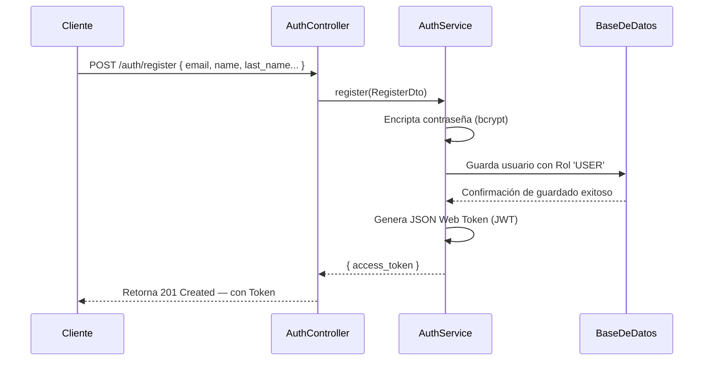
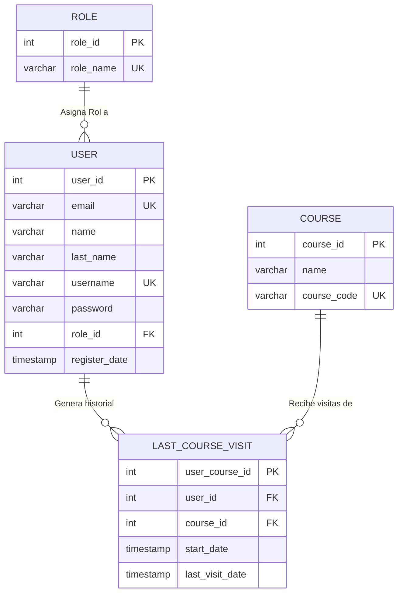

# Arquitectura y Base de Datos del Módulo de Autenticación y Usuarios

## 1. Arquitectura del Sistema

### Descripción General

En **UniOpenCourse**, la gestión de usuarios y la autenticación están integrados en un único módulo para centralizar la seguridad: el **Módulo de Auth**. No existe un módulo independiente solo para usuarios, ya que las operaciones de creación y validación recaen directamente sobre los servicios de autenticación y la base de datos a través de **Prisma ORM**.

La lógica del sistema se distribuye de la siguiente manera:

| Responsabilidad              | Componente Encargado               |
|-----------------------------|------------------------------------|
| Creación de usuario          | `AuthService.register()`           |
| Autenticación de usuario     | `AuthService.login()`              |
| Autenticación de admin       | `AuthService.adminLogin()`         |
| Modelo de datos              | Esquema de Base de Datos (`Prisma`) |
| Autorización por roles       | `RolesGuard` + Decorador `@Roles()`|
| Verificación de identidad    | `JwtStrategy` + `JwtAuthGuard`     |

---

### Estructura Interna del Módulo

El flujo de trabajo se organiza en controladores, servicios, DTOs y Guards, siguiendo las buenas prácticas de NestJS:

```text
auth/
├── auth.module.ts              # Configuración principal y dependencias JWT
├── auth.controller.ts          # Exposición de Endpoints de acceso/registro
├── auth.service.ts             # Lógica de negocio (registro, login, logout)
├── dto/
│   ├── register.dto.ts         # Validaciones para crear un usuario
│   └── login.dto.ts            # Validaciones para inicio de sesión
├── strategies/
│   └── jwt.strategy.ts         # Estrategia de Passport para decodificar JWT
├── guards/
│   ├── jwt-auth.guard.ts       # Guard para requerir un token JWT válido
│   └── roles.guard.ts          # Guard para requerir un rol específico
└── decorators/
    └── roles.decorator.ts      # Decorador personalizado `@Roles()`
```

---

### Diagrama de Componentes

```mermaid
graph TD
    subgraph Módulo Auth
        AC[AuthController]
        AS[AuthService]
        JS[JwtStrategy]
        JG[JwtAuthGuard]
        RG[RolesGuard]
        RD["@Roles() Decorator"]
    end

    subgraph Validaciones (DTOs)
        RDTO[RegisterDto]
        LDTO[LoginDto]
    end

    subgraph Infraestructura
        PS[PrismaService]
        JWT[JwtService]
        CFG[ConfigService]
    end

    subgraph Base de Datos (PostgreSQL)
        UM[(Tabla User)]
        RM[(Tabla Role)]
        LCV[(Tabla LastCourseVisit)]
    end

    AC -->|Usa| AS
    AS -->|Inyecta| PS
    AS -->|Genera Token| JWT
    JS -->|Lee Secret| CFG
    JS -->|Valida| JWT
    JG -->|Hereda de| PassportStrategy
    RG -->|Verifica metadata| RD
    AC -->|Valida request con| RDTO
    AC -->|Valida request con| LDTO
    PS --> UM
    PS --> RM
    UM -->|Foreign Key| RM
    UM -->|Relación 1:N| LCV
```

---

### Flujo de Creación de Usuario (Registro)

El siguiente modelo ilustra el proceso interno al registrar un usuario en el sistema:



---

### Sistema de Roles y Autorización

Para manejar los niveles de acceso, el sistema utiliza dos roles globales (precargados inicialmente en la base de datos):

| Rol     | Nivel de Acceso                                  |
|---------|--------------------------------------------------|
| `USER`  | Nivel estándar. Asignado por defecto al registrarse. |
| `ADMIN` | Nivel administrativo. Asignado manualmente por seguridad. |

**Uso práctico en código:**
Para proteger una ruta y restringirla solo a administradores, se combinan Guards y Decoradores:

```typescript
@UseGuards(JwtAuthGuard, RolesGuard)
@Roles('ADMIN')
@Get('ruta-administrativa')
metodoRestringido() { ... }
```

---

### Tecnologías y Dependencias Principales

El módulo utiliza librerías estándares de seguridad y encriptación:

| Herramienta / Paquete   | Propósito Integrado                             |
|-------------------------|-------------------------------------------------|
| `@nestjs/jwt`           | Creación segura y lectura de tokens JWT.        |
| `@nestjs/passport`      | Motor subyacente para estrategias de seguridad. |
| `passport-jwt`          | Verificación del contenido del JWT.             |
| `bcrypt`                | Hashing unidireccional de contraseñas.          |
| `@nestjs/config`        | Lectura segura de secretos desde variables de entorno. |

---

## 2. Modelos de Base de Datos

### Aspectos Generales

- **Gestor de Base de Datos:** PostgreSQL
- **Herramienta ORM:** Prisma
- **Esquema Central:** La estructura principal se encuentra definida de forma centralizada en el esquema de Prisma, el cual se encarga de generar automáticamente el cliente tipado para TypeScript.

---

### Modelo `Role` (Roles de Acceso)

Define y estandariza los roles permitidos en la plataforma, asegurando control absoluto sobre los niveles de acceso del sistema.

```prisma
model Role {
  role_id   Int    @id @default(autoincrement())
  role_name String @unique @db.VarChar(50)
  users     User[]
}
```

**Estructura Técnica:**
- `role_id`: *(Clave Primaria)* Identificador único auto incremental.
- `role_name`: Define si el usuario es `ADMIN` o `USER`. Tiene restricción de unicidad para evitar duplicados.

**Valores predeterminados (Seed):**
Por defecto, la base de datos debería contener los roles base: `ADMIN` y `USER`.

---

### Modelo `User` (Usuarios)

Almacena la información fundamental de todas las personas registradas, aplicando estándares de seguridad robustos para credenciales.

```prisma
model User {
  user_id         Int               @id @default(autoincrement())
  email           String            @unique @db.VarChar(75)
  name            String            @db.VarChar(50)
  last_name       String            @db.VarChar(50)
  username        String            @unique @db.VarChar(70)
  password        String            @db.VarChar(255)
  role_id         Int
  register_date   DateTime          @default(now())
  
  role            Role              @relation(fields: [role_id], references: [role_id])
  visited_courses LastCourseVisit[]
}
```

**Características Críticas:**
- `email` y `username`: Atributos estrictamente únicos (`@unique`). Sirven como mecanismos principales para inicio de sesión e identificación técnica.
- `password`: Encriptado con algoritmo Hash unidireccional (bcrypt). **Por normativa de seguridad, jamás se almacena la contraseña original ni se expone a través de las APIs.**
- **Relaciones:** Todo usuario se enlaza obligatoriamente con un Rol específico, y opcionalmente contiene un historial de seguimiento a los cursos visitados.

---

### Modelo `LastCourseVisit` (Historial de Visitas)

Tabla pivote o puente que vincula a un Usuario con los Cursos a los que ha accedido. Ideal para facilitar de métricas o permitir la reanudación de progreso.

```prisma
model LastCourseVisit {
  user_course_id    Int      @id @default(autoincrement())
  user_id           Int
  course_id         Int
  start_date        DateTime @default(now())
  last_visit_date   DateTime @updatedAt
  
  user              User     @relation(fields: [user_id], references: [user_id], onDelete: Cascade)
  course            Course   @relation(fields: [course_id], references: [course_id], onDelete: Cascade)

  @@unique([user_id, course_id])
}
```

**Comportamiento Dinámico:**
- **Control de Duplicados:** La restricción `@@unique([user_id, course_id])` asegura que un usuario no tenga múltiples entradas para el mismo curso. Una revisita actualizará únicamente la marca temporal de `last_visit_date`.
- **Limpieza en Cascada:** Al eliminar una cuenta de `User` o un `Course`, todos sus historiales entrelazados se borran automáticamente (`onDelete: Cascade`), preservando la limpieza relacional.

---

### Diagrama Entidad-Relación (Sección Usuarios)



---

### Migraciones Aplicadas

El motor de bases de datos ha evolucionado aplicando cambios incrementales controlados (migraciones), lo cual asegura un entorno de trabajo unificado:

| Migración (Ejemplo)                                | Motivo en el código                             |
|----------------------------------------------------|-----------------------------------------------------|
| `..._init`                              | Setup y creación principal                  |
| `..._fix_deleting_cascade`              | Soporte paramétrico para eliminación en cascada|
| `..._enlarging_nombres_database`        | Incremento de caracteres seguros para columnas |
| `..._chanching_english_database`        | Refactorización para estándares de inglés         |
| `..._adding_unique_role_name`           | Incremento de seguridad anti-duplicados     |

---

### Datos Iniciales (Seed)

El sistema facilita un proceso automático en el backend diseñado para rellenar la base de datos con un contexto operativo mínimo mediante un "Seed" (`seed.ts`).
Normalmente, el comando genera:
- Los roles `ADMIN` y `USER`.
- (Opcional en desarrollo) Una cuenta base de Administrador para pruebas preliminares.

> **Importante / Seguridad Dev:** Las cuentas generadas por el archivo de demostración Seed portan credenciales estáticas por defecto. Bajo ninguna circunstancia estas credenciales de prueba deben subir activadas y sin modificar a entornos Productivos. Todos los entornos de staging y producción deben aplicar rotación segura del acceso principal inmediatamente después del primer lanzamiento.

**Comando rápido para hidratar (Desarrollo):**
```bash
npx prisma db seed
```
