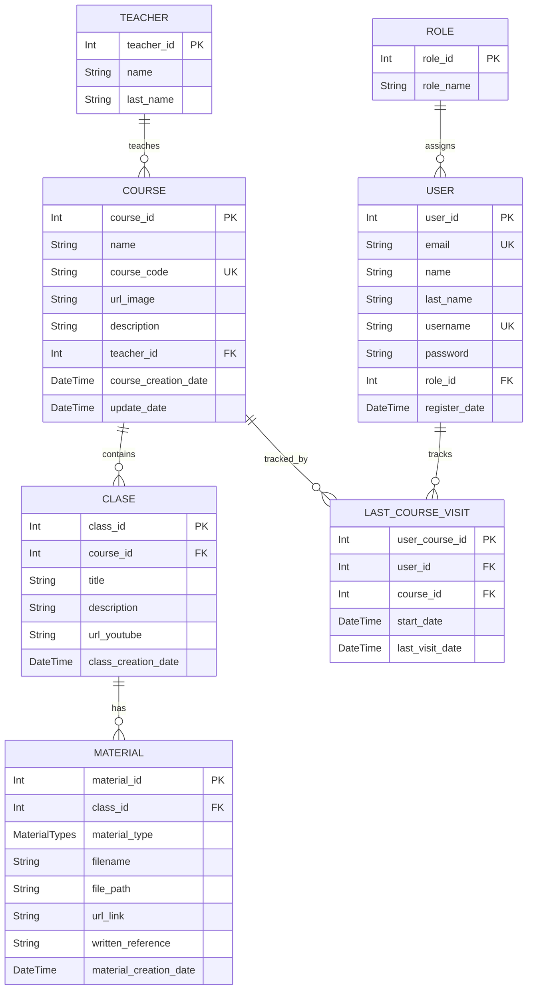

# Base de datos — UniOpenCourse (Backend)

Documentación técnica del **modelo de datos** usado por el backend, a partir de `apps/backend/prisma/schema.prisma` (Prisma ORM) y su ejecución sobre **PostgreSQL**.

---

## Descripción general de la base de datos

La base de datos soporta los flujos centrales de la plataforma:

- **Autenticación y autorización**: usuarios y roles.
- **Catálogo académico**: docentes, cursos y clases.
- **Seguimiento**: última visita de un usuario a un curso.
- **Recursos**: materiales asociados a clases.

### Enfoque de modelado

- **Tipo**: relacional (PostgreSQL).
- **ORM**: Prisma.
- **Normalización**: modelos separados por dominio (usuarios/roles, cursos/docentes/clases/materiales) y una entidad asociativa (`LastCourseVisit`) para representar la relación **Usuario–Curso** con atributos temporales.
- **Evolución del esquema**: mediante **migraciones Prisma** en `apps/backend/prisma/migrations/`.

### Infraestructura DB (Prisma) — notas esenciales

- **Datasource**: `provider = "postgresql"` (URL de conexión provista por `DATABASE_URL` en runtime).
- **Cliente Prisma generado**: el schema configura salida en `apps/backend/src/generated/prisma` (ver `generator client`).
- **Conexión**: el backend usa Prisma con adaptador `@prisma/adapter-pg` leyendo `process.env.DATABASE_URL`.

---

## Diagrama Entidad–Relación (ER)

> Diagrama generado desde el schema de Prisma. Muestra cardinalidades y llaves relevantes.

### Entidades principales

| Entidad           | Descripción breve                                               |
| ----------------- | --------------------------------------------------------------- |
| `Role`            | Define roles para control de acceso (asignación a usuarios).    |
| `User`            | Usuarios registrados; contiene credenciales y referencia a rol. |
| `Teacher`         | Docentes responsables de cursos.                                |
| `Course`          | Cursos publicados; enlaza docente y agrupa clases.              |
| `Class`           | Clases/unidades dentro de un curso (contenido + video).         |
| `Material`        | Recursos asociados a una clase (archivo/enlace/referencia).     |
| `LastCourseVisit` | Relación usuario–curso con marcas de tiempo de visita.          |
| `MaterialTypes`   | Enum de tipos de material (`file`, `link`, `reference`).        |

### Relaciones

- `Role` **1:N** `User` (un rol puede asignarse a muchos usuarios).
- `Teacher` **1:N** `Course` (un docente tiene muchos cursos).
- `Course` **1:N** `Class` (un curso tiene muchas clases).
- `Class` **1:N** `Material` (una clase tiene muchos materiales).
- `User` **N:N** `Course` a través de `LastCourseVisit`, que guarda:
  - fecha de inicio (`start_date`)
  - fecha de última visita (`last_visit_date`)

---

## Course

### Propósito

Representa un curso disponible dentro de la plataforma.

### Campos principales

Tabla con campos, tipo y descripción.

### Relaciones

- Un curso tiene muchas clases.
- Un curso puede pertenecer a rutas de aprendizaje.
- Un curso puede tener visitas de usuarios.

### Reglas

- El código del curso debe ser único.
- La eliminación debe considerar clases y registros asociados.

---

## Migraciones y seed data

- **Migraciones**: existen en `apps/backend/prisma/migrations/` y representan la evolución del esquema.
- **Seed data**: en el repositorio actual **no** se encontró un archivo de seed (`prisma/seed.*` o `seed.ts`).
  - Si se requiere precargar roles (p.ej. `ADMIN`/`USER`), debe implementarse explícitamente un proceso de seed o una estrategia de bootstrap en la aplicación.
