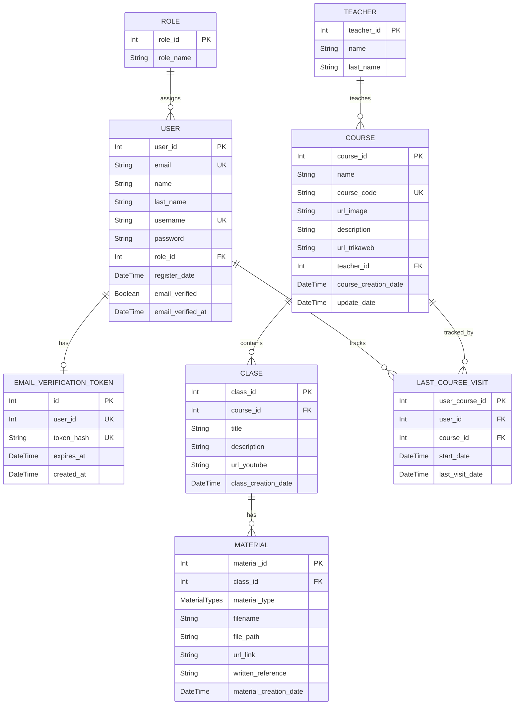

# Base de datos — UniOpenCourse (Backend)

Documentación técnica del **modelo de datos** usado por el backend, a partir de `apps/backend/prisma/schema.prisma` (Prisma ORM) y su ejecución sobre **PostgreSQL**.

---

## Descripción general de la base de datos

La base de datos soporta los flujos centrales de la plataforma:

- **Autenticación y autorización**: usuarios, roles y verificación de correo electrónico.
- **Catálogo académico**: docentes, cursos y clases.
- **Seguimiento**: última visita de un usuario a un curso.
- **Recursos**: materiales asociados a clases.

### Enfoque de modelado

- **Tipo**: relacional (PostgreSQL).
- **ORM**: Prisma.
- **Normalización**: modelos separados por dominio (usuarios/roles, cursos/docentes/clases/materiales) y una entidad asociativa (`LastCourseVisit`) para representar la relación **Usuario–Curso** con atributos temporales.
- **Evolución del esquema**: mediante **migraciones Prisma** en `apps/backend/prisma/migrations/`.

### Infraestructura DB (Prisma) — notas esenciales

- **Datasource**: `provider = "postgresql"` (URL de conexión provista por `DATABASE_URL` en runtime).
- **Cliente Prisma generado**: el schema configura salida en `apps/backend/src/generated/prisma` (ver `generator client`).
- **Conexión**: el backend usa Prisma con adaptador `@prisma/adapter-pg` leyendo `process.env.DATABASE_URL`.

---

## Diagrama Entidad–Relación (ER)

> Diagrama generado desde el schema de Prisma. Muestra cardinalidades y llaves relevantes.



### Entidades principales

| Entidad                  | Descripción breve                                                           |
| ------------------------ | --------------------------------------------------------------------------- |
| `Role`                   | Define roles para control de acceso (asignación a usuarios).                |
| `User`                   | Usuarios registrados; credenciales, rol y estado de verificación de correo. |
| `EmailVerificationToken` | Token de verificación de correo (hash SHA-256); relación 1:1 con `User`.    |
| `Teacher`                | Docentes responsables de cursos.                                            |
| `Course`                 | Cursos publicados; enlaza docente y agrupa clases.                          |
| `Class`                  | Clases/unidades dentro de un curso (contenido + video).                     |
| `Material`               | Recursos asociados a una clase (archivo/enlace/referencia).                 |
| `LastCourseVisit`        | Relación usuario–curso con marcas de tiempo de visita.                      |
| `MaterialTypes`          | Enum de tipos de material (`file`, `link`, `reference`).                    |

### Relaciones

- `Role` **1:N** `User` (un rol puede asignarse a muchos usuarios).
- `User` **1:0..1** `EmailVerificationToken` (como máximo un token activo por usuario; constraint único en `user_id`).
- `Teacher` **1:N** `Course` (un docente tiene muchos cursos).
- `Course` **1:N** `Class` (un curso tiene muchas clases).
- `Class` **1:N** `Material` (una clase tiene muchos materiales).
- `User` **N:N** `Course` a través de `LastCourseVisit`, que guarda:
  - fecha de inicio (`start_date`)
  - fecha de última visita (`last_visit_date`)

---

## Role

### Propósito

Define el rol asignable a usuarios para habilitar la autorización por perfiles (RBAC) en el sistema.

### Campos principales

| Campo       | Tipo   | Descripción                             |
| ----------- | ------ | --------------------------------------- |
| `role_id`   | Int    | (PK) Identificador interno del rol.     |
| `role_name` | String | Nombre del rol (p.ej. `ADMIN`, `USER`). |

### Relaciones

- Un rol puede ser asignado a múltiples usuarios (`1:N`).

### Reglas

- El backend asume que este rol es la base para el control de permisos en rutas protegidas.

---

## User

### Propósito

Almacena la identidad y credenciales de acceso de las personas. Es el punto de entrada para autorización y trazabilidad de los cursos.

### Campos principales

| Campo               | Tipo      | Descripción                                                   |
| ------------------- | --------- | ------------------------------------------------------------- |
| `user_id`           | Int       | (PK) Identificador interno del usuario.                       |
| `email`             | String    | (UK) Identificador único principal para login y recuperación. |
| `name`              | String    | Nombres del usuario.                                          |
| `last_name`         | String    | Apellidos del usuario.                                        |
| `username`          | String    | (UK) Alias único, usado como alternativa de identificación.   |
| `password`          | String    | Hash encriptado de la contraseña (nunca texto plano).         |
| `role_id`           | Int       | (FK) Identificador del rol asignado.                          |
| `register_date`     | DateTime  | Fecha y hora de creación de la cuenta.                        |
| `email_verified`    | Boolean   | Indica si el correo fue confirmado (`default: false`).        |
| `email_verified_at` | DateTime? | Fecha de verificación; `null` si aún no verificó.             |

### Relaciones

- Un usuario posee obligatoriamente un rol (`N:1`).
- Un usuario puede tener como máximo un token de verificación activo (`1:0..1` con `EmailVerificationToken`).
- Un usuario puede registrar visitas e historial en múltiples cursos.

### Reglas

- Los campos `email` y `username` son estrictamente únicos.
- El login de usuarios con rol `USER` exige `email_verified = true` (validado en `AuthService`, no con constraint en BD).
- Al eliminar un usuario, sus tokens de verificación y todo su historial en `LastCourseVisit` se eliminan en cascada.

---

## EmailVerificationToken

### Propósito

Persiste el enlace de verificación de correo enviado al registrarse o al solicitar reenvío. El token en texto plano viaja por correo; en base de datos solo se guarda su hash SHA-256 (64 caracteres hex), lo que permite búsqueda indexada sin almacenar el secreto en claro.

### Campos principales

| Campo        | Tipo     | Descripción                                                           |
| ------------ | -------- | --------------------------------------------------------------------- |
| `id`         | Int      | (PK) Identificador interno del registro.                              |
| `user_id`    | Int      | (FK, UK) Usuario dueño del token; relación 1:1.                       |
| `token_hash` | String   | (UK) Hash SHA-256 del token enviado por correo (`VarChar(64)`).       |
| `expires_at` | DateTime | Fecha límite de validez del enlace.                                   |
| `created_at` | DateTime | Fecha de emisión; usada para el cooldown de reenvío en la aplicación. |

### Relaciones

- Pertenece a un único usuario (`N:1`); al borrar el usuario, el token se elimina en cascada (`onDelete: Cascade`).

### Reglas

- **`user_id` único**: solo puede existir un token por usuario; los reenvíos hacen upsert sobre la misma fila.
- **`token_hash` único**: evita colisiones entre tokens distintos.
- Tras verificar el correo con éxito, la aplicación elimina todos los tokens del usuario.
- La expiración se valida en aplicación (`expires_at < now()`); no hay job automático en BD que limpie tokens vencidos.
- Al rotar token en reenvío, `created_at` se actualiza para calcular el cooldown (`EMAIL_RESEND_COOLDOWN_MINUTES`).

### Uso en la aplicación

- **Registro**: se crea usuario y token en la misma transacción Prisma.
- **Verificación**: búsqueda por `token_hash`; si es válido y no expiró, se marca `User.email_verified` y se borran los tokens.
- **Reenvío**: transacción con `SELECT ... FOR UPDATE` sobre el usuario antes de rotar el hash y la fecha de expiración.

---

## Teacher

### Propósito

Representa a los docentes o instructores responsables de dictar los cursos de la plataforma.

### Campos principales

| Campo        | Tipo   | Descripción                             |
| ------------ | ------ | --------------------------------------- |
| `teacher_id` | Int    | (PK) Identificador interno del docente. |
| `name`       | String | Nombres del docente.                    |
| `last_name`  | String | Apellidos del docente.                  |

### Relaciones

- Un docente puede ser asignado como responsable de múltiples cursos (`1:N`).

### Reglas

- En este schema básico no se requiere email único, pero el sistema debe garantizar la integridad de su información.

---

## Course

### Propósito

Define los cursos publicados en la plataforma. Actúa como el agrupador principal que enlaza a un docente con sus respectivas clases.

### Campos principales

| Campo                  | Tipo     | Descripción                                                        |
| ---------------------- | -------- | ------------------------------------------------------------------ |
| `course_id`            | Int      | (PK) Identificador interno del curso.                              |
| `name`                 | String   | Nombre visible del curso.                                          |
| `course_code`          | String   | (UK) Código corto e identificador único del curso (ej. `MAT-101`). |
| `url_image`            | String   | URL de la imagen de portada.                                       |
| `description`          | String   | Descripción detallada del curso.                                   |
| `url_trikaweb`         | String?  | URL opcional para enlazar las evaluaciones en Trikaweb.            |
| `teacher_id`           | Int      | (FK) Identificador del docente asignado.                           |
| `course_creation_date` | DateTime | Fecha de creación del curso.                                       |
| `update_date`          | DateTime | Fecha de última modificación del curso.                            |

### Relaciones

- Un curso es dictado obligatoriamente por un docente (`N:1`).
- Un curso contiene múltiples clases (`1:N`).
- Un curso registra múltiples historiales de visitas de usuarios.

### Reglas

- El código del curso (`course_code`) debe ser único.
- La eliminación de un curso elimina en cascada sus registros de visitas. No elimina en cascada sus clases; si tiene clases asignadas, lanzará un error de restricción de clave foránea.

---

## LastCourseVisit

### Propósito

Entidad asociativa que modela la relación de "Muchos a Muchos" entre Usuario y Curso, almacenando las métricas de seguimiento temporal (cuándo empezó y cuándo fue su última visita).

### Campos principales

| Campo             | Tipo     | Descripción                                                            |
| ----------------- | -------- | ---------------------------------------------------------------------- |
| `user_course_id`  | Int      | (PK) Identificador interno del registro.                               |
| `user_id`         | Int      | (FK) Identificador del usuario.                                        |
| `course_id`       | Int      | (FK) Identificador del curso visitado.                                 |
| `start_date`      | DateTime | Fecha del primer acceso o inscripción.                                 |
| `last_visit_date` | DateTime | Se actualiza automáticamente cada vez que el usuario ingresa al curso. |

### Relaciones

- Vincula un usuario con un curso.

### Reglas

- **Unicidad combinada**: Solo puede existir un único registro por cada combinación de `user_id` y `course_id`. Las nuevas visitas actualizan el campo temporal, no crean filas nuevas.
- Eliminación en cascada garantizada si el usuario o el curso desaparecen de la plataforma.

---

## Class

### Propósito

Representa una unidad de contenido dentro de un curso, agrupando una descripción, un video principal y materiales de apoyo.

### Campos principales

| Campo                 | Tipo     | Descripción                                         |
| --------------------- | -------- | --------------------------------------------------- |
| `class_id`            | Int      | (PK) Identificador único de la clase.               |
| `course_id`           | Int      | (FK) Identificador del curso al que pertenece.      |
| `title`               | String   | Título visible de la clase.                         |
| `description`         | String   | Descripción larga del contenido de la clase.        |
| `url_youtube`         | String?  | Enlace al video principal de la lección (Opcional). |
| `class_creation_date` | DateTime | Fecha y hora en la que se creó la clase.            |

### Relaciones

- Una clase pertenece obligatoriamente a un único curso.
- Una clase puede tener múltiples materiales de apoyo asociados.

### Reglas

- **NO** existe eliminación en cascada de clases al borrar un curso. Intentar borrar un curso con clases causará una restricción de clave foránea.
- No puede existir una clase "huérfana" (sin `course_id`).

---

## Material

### Propósito

Representa los recursos adicionales de apoyo vinculados a una clase. Soporta tres formatos distintos a través de un enumerador: archivos físicos, enlaces externos o referencias de texto.

### Campos principales

| Campo               | Tipo          | Descripción                                                   |
| ------------------- | ------------- | ------------------------------------------------------------- |
| `material_id`       | Int           | (PK) Identificador único del material.                        |
| `class_id`          | Int           | (FK) Identificador de la clase a la que pertenece.            |
| `material_type`     | MaterialTypes | Enum que define si es `file`, `link` o `reference`.           |
| `filename`          | String        | Nombre visible del material para el usuario.                  |
| `file_path`         | String?       | Ruta de almacenamiento en el servidor (si es de tipo `file`). |
| `url_link`          | String?       | URL externa (si es de tipo `link`).                           |
| `written_reference` | String?       | Texto bibliográfico o literario (si es de tipo `reference`).  |

### Relaciones

- Un material pertenece obligatoriamente a una única clase.

### Reglas

- La eliminación de una clase desencadena la eliminación en cascada de todos sus materiales.
- **Validación condicional**: Dependiendo del valor de `material_type`, el sistema exigirá que el campo correspondiente (`file_path`, `url_link` o `written_reference`) contenga datos válidos.
- Si el tipo es `file`, el sistema debe asegurar que el archivo cumpla con los límites de seguridad (tamaño y MIME) en el servidor.

---

## Restricciones importantes

A nivel general de la base de datos se manejan las siguientes restricciones de integridad:

- **Unicidad de usuarios:** Los campos `email` y `username` de la entidad `User` son únicos (Unique Constraints).
- **Control de tokens:** La tabla `EmailVerificationToken` posee un constraint único en `user_id` para garantizar la existencia de máximo un token por usuario, además de un índice único en `token_hash` para evitar colisiones.
- **Unicidad de cursos:** El campo `course_code` en `Course` es único para evitar duplicidad de cursos académicos.
- **Unicidad de historial:** En `LastCourseVisit`, la combinación del par (`user_id`, `course_id`) es única por definición (modelo asociativo de muchos a muchos).
- **Restricciones y Cascadas:** La eliminación en cascada (`onDelete: Cascade`) está configurada en dependencias como Usuario -> Token o Curso -> Visitas. Sin embargo, la relación **Curso -> Clase no tiene cascada**, generando una restricción protectora al intentar eliminar un curso con clases.

---

## Decisiones de modelado

- **Polimorfismo mitigado:** En lugar de crear tablas separadas para cada tipo de material (archivo físico, enlace externo, referencia de texto), se optó por una única tabla `Material` con un Enum `material_type`. Esto simplifica las consultas y el mantenimiento, aunque exige validación lógica a nivel de aplicación (ej. validar que si el tipo es 'link', el campo `url_link` no esté vacío).
- **Tokens de verificación seguros:** Se decidió extraer el token de verificación a una entidad separada (`EmailVerificationToken`) con relación 1:1, en lugar de ponerlo como un campo nulo dentro del `User`. Esto facilita el control de expiración (`expires_at`), la emisión (`created_at`) y permite escalar a una relación 1:N en el futuro si se requieren múltiples tipos de tokens. Además, solo se almacena el Hash SHA-256 del token para prevenir filtraciones de la base de datos.
- **Registro de visitas como upsert:** La tabla `LastCourseVisit` se diseñó no como un simple log (que generaría millones de filas rápidamente), sino como un estado acumulativo. Se registra el momento de inicio (`start_date`) y solo se actualiza la fecha de la última visita (`last_visit_date`) utilizando un Upsert.
- **Roles numéricos:** Se utilizó un `role_id` numérico con su respectiva tabla `Role` en lugar de un Enum de PostgreSQL. Esto permite una mayor flexibilidad futura para la gestión dinámica de roles a través de un panel de administrador sin necesidad de correr migraciones de base de datos cada vez que se cree un nuevo perfil.

---

## Migraciones y seed data

- **Migraciones**: existen en `apps/backend/prisma/migrations/` y representan la evolución del esquema.

### Migraciones relevantes — verificación de correo

| Migración                                           | Cambios                                                                                                                                                                                                                                                                                                   |
| --------------------------------------------------- | --------------------------------------------------------------------------------------------------------------------------------------------------------------------------------------------------------------------------------------------------------------------------------------------------------- |
| `20260815050418_add_email_verification`             | Añade `email_verified` y `email_verified_at` a `User`. Crea tabla `EmailVerificationToken` con índice único en `token_hash` e índice en `user_id`. **Backfill**: usuarios existentes quedan con `email_verified = true` y `email_verified_at = NOW()` para no bloquear cuentas creadas antes del feature. |
| `20260819200000_unique_verification_token_per_user` | Elimina tokens duplicados por usuario (conserva el más reciente). Reemplaza índice no único en `user_id` por constraint **único** (`user_id` UK), garantizando un solo token activo por usuario.                                                                                                          |

- **Seed data**: El seed se encuentra en [apps/backend/prisma/seed.ts](../apps/backend/prisma/seed.ts). Carga los datos del usuario administrador de acuerdo al .env y genera los roles para el funcionamiento del proyecto. Su ejecución se realiza mediante el comando:

  ```bash
  npx prisma db seed
  ```

### Enlaces relacionados

- Lógica de negocio Auth: [`backend.md`](./backend.md) (módulos Auth y Mail).
- Contratos HTTP: [`endpoints.md`](./endpoints.md) (sección Auth).
