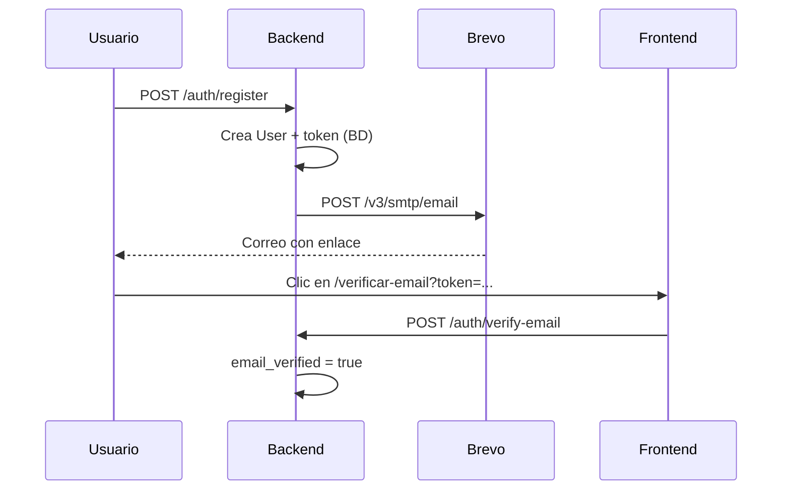

# Brevo — UniOpenCourse

Documentación sobre **qué es Brevo**, **cómo se usa en el proyecto** y **qué permite hacer** la plataforma. Para configurar una cuenta paso a paso, ver [`BREVO-TUTORIAL.md`](./BREVO-TUTORIAL.md).

---

## Qué es Brevo

[Brevo](https://www.brevo.com) (antes Sendinblue) es un proveedor de **correo transaccional**: entrega emails disparados por la aplicación (registro, verificación, recuperación de contraseña, etc.), distinto del correo masivo de marketing.

En UniOpenCourse actúa como **servicio externo de envío**: el backend no tiene servidor SMTP propio; delega la entrega a la API de Brevo.

---

## Rol en UniOpenCourse

Brevo interviene **solo** en el flujo de **verificación de correo al registrarse** (y en los **reenvíos** del mismo enlace).

| Momento                                  | Quién dispara el envío                                           | Qué recibe el usuario                    |
| ---------------------------------------- | ---------------------------------------------------------------- | ---------------------------------------- |
| Registro exitoso                         | `AuthService.register()` → `MailService.sendVerificationEmail()` | Correo HTML con botón “Verificar correo” |
| Reenvío desde login o `/verificar-email` | `AuthService.resendVerificationEmail()` → mismo método           | Nuevo correo con enlace actualizado      |

El enlace apunta a:

```
{FRONTEND_URL}/verificar-email?token={token_en_texto_plano}
```

El token en BD se guarda hasheado (SHA-256); Brevo **no** conoce ni almacena tokens ni datos de usuarios más allá del destinatario y contenido del mensaje.

---

## Integración en el código

```
AuthService  →  MailService  →  POST https://api.brevo.com/v3/smtp/email
                     ↑
              BREVO_API_KEY, MAIL_FROM, FRONTEND_URL
```

| Pieza                  | Ubicación                               |
| ---------------------- | --------------------------------------- |
| Envío                  | `apps/backend/src/mail/mail.service.ts` |
| Módulo                 | `apps/backend/src/mail/mail.module.ts`  |
| Escape HTML del nombre | `apps/backend/src/mail/html.utils.ts`   |
| Consumidor             | `apps/backend/src/auth/auth.service.ts` |

**Detalles de implementación:**

- Llamada HTTP con `fetch` nativo; **no** hay SDK oficial de Brevo en el proyecto.
- Autenticación: header `api-key` con `BREVO_API_KEY`.
- Cuerpo JSON: `sender`, `to`, `subject`, `htmlContent`.
- Timeout configurable (`BREVO_REQUEST_TIMEOUT_MS`, default 15 s).
- El nombre del destinatario en el HTML pasa por `escapeHtml()` antes de interpolarse.

Si Brevo falla **después** de crear el usuario en BD, el registro **no se revierte**; el usuario puede usar “Reenviar correo”. El error se registra en consola del backend.

Documentación técnica del módulo: [`backend.md`](./backend.md) (Módulo Mail).

---

## Variables de entorno

| Variable                   | Obligatoria | Descripción                                                                   |
| -------------------------- | ----------- | ----------------------------------------------------------------------------- |
| `BREVO_API_KEY`            | Sí          | Clave de API de la cuenta Brevo                                               |
| `MAIL_FROM`                | Sí          | Remitente verificado en Brevo (ej. `UniOpenCourse <tu@gmail.com>`)            |
| `FRONTEND_URL`             | Sí\*        | Base del enlace de verificación (\*default `http://localhost:3000` en código) |
| `BREVO_REQUEST_TIMEOUT_MS` | No          | Timeout de la petición (default 15000)                                        |

Otras variables del flujo de verificación (expiración del token, cooldown de reenvío) las controla `AuthService`, no Brevo directamente: ver [`backend.md`](./backend.md).

---

## Qué hace Brevo hoy en el proyecto

| Capacidad                               | ¿Usado? | Notas                               |
| --------------------------------------- | ------- | ----------------------------------- |
| Email transaccional vía API REST        | Sí      | Endpoint `/v3/smtp/email`           |
| Plantillas guardadas en Brevo           | No      | HTML inline en `MailService`        |
| SMTP relay                              | No      | Solo API HTTP                       |
| Campañas / email marketing              | No      | Fuera del alcance actual            |
| SMS / WhatsApp                          | No      | Brevo los ofrece; no integrados     |
| Webhooks de entrega (delivered, bounce) | No      | Posible extensión futura            |
| Listas de contactos / CRM               | No      | No sincronizamos usuarios con Brevo |

---

## Qué se puede hacer con Brevo (más allá de lo implementado)

Brevo expone otras funcionalidades que **podrían** adoptarse sin cambiar de proveedor:

1. **Más tipos de correo transaccional** — recuperación de contraseña, aviso de cambio de email, notificaciones de admin.
2. **Plantillas en el panel de Brevo** — diseño editable sin redeploy; el backend enviaría `templateId` + parámetros en lugar de HTML embebido.
3. **Remitente con dominio propio** — en producción, verificar `mail.uni.edu.pe` en lugar de Gmail/Outlook mejora deliverability y marca.
4. **Estadísticas y logs** — panel de Brevo muestra envíos, aperturas y rebotes; útil para depurar “no me llegó el correo”.
5. **Webhooks** — el backend podría recibir eventos `delivered`, `hard_bounce`, `spam` para marcar emails inválidos o alertar.
6. **IP dedicada / reputación** — planes superiores para alto volumen y menor riesgo de spam folder.

Cualquier extensión implicaría nuevos métodos en `MailService` (o un servicio de notificaciones) y, si aplica, nuevas variables de entorno.

---

## Requisitos de Brevo para que el envío funcione

1. **Cuenta activa** con API key válida.
2. **Remitente verificado** — el email en `MAIL_FROM` debe coincidir con un sender _Verified_ en el panel.
3. **IP autorizada** (desarrollo) — en local suele hacer falta desactivar el bloqueo de IP desconocida para API keys; ver tutorial paso 4.

Sin API key o remitente, `MailService` lanza `InternalServerErrorException` antes de llamar a la red.

---

## Límites y entorno

| Aspecto               | Detalle                                                                                       |
| --------------------- | --------------------------------------------------------------------------------------------- |
| Plan usado en dev     | Brevo Free (~300 emails/día)                                                                  |
| Uso típico del equipo | Registro + reenvíos ocasionales; suficiente para facultad y pruebas                           |
| Producción            | Evaluar dominio verificado, límites del plan y restricción de IP activada solo en servidor    |
| Privacidad            | Cada desarrollador puede usar su propia cuenta Brevo en local; las keys no van al repositorio |

---

## Flujo resumido (registro → correo → verificación)



---

## Enlaces relacionados

| Documento                                  | Contenido                                                               |
| ------------------------------------------ | ----------------------------------------------------------------------- |
| [`BREVO-TUTORIAL.md`](./BREVO-TUTORIAL.md) | Configuración paso a paso (cuenta, API key, remitente, `.env`, pruebas) |
| [`backend.md`](./backend.md)               | Módulos Auth y Mail, reglas de reenvío y cooldown                       |
| [`frontend.md`](./frontend.md)             | Pantallas `/registro`, `/verificar-email`, reenvío desde login          |
| [`endpoints.md`](./endpoints.md)           | Contratos HTTP de auth                                                  |
| [`base-de-datos.md`](./base-de-datos.md)   | Tabla `EmailVerificationToken`                                          |
